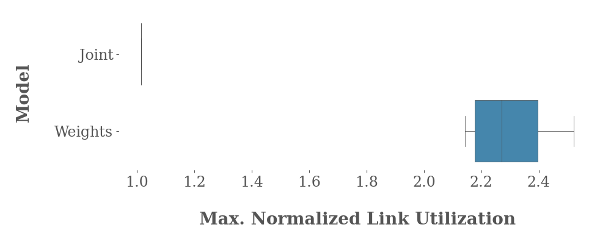

# Traffic Engineering with Joint Link Weight and Segment Optimization &ndash; Experiments
## Overview
This repository contains the code for running the experiments that are presented within the publication **Traffic Engineering with Joint Link Weight and Segment Optimization**. Please also note [our website](https://whatif-tools.net/segment-routing/).

There are two options for how to run our experiments:

* You can either run the experiments directly using the shell scripts. Using our `nanonet_batch.py` script, you can even automate the test execution, if you want to run both tests multiple times.
* Or you can "compile" them on your own with Nanonet if you like to configure some parameters.

## Run the test scripts directly
### System requirements
* Linux with Kernel version &gt; 4.17<br>
We ran our tests using version `5.4.0-74` and `5.4.0-66`, but any more recent Kernel version should suffice. The very basic network tools, like `ip`, `ifconfig` and `tc`, as well as the `bash` shell are also required (if you do not have installed `ifconfig`, you can install it with `apt install net-tools`). You also need `at`, which can be installed with e.g. `apt install at`.

* `nuttcp`<br>
[`nuttcp`](https://www.nuttcp.net/) is a network performance measurement tool. If you use a Debian-based Linux distribution, you can install it, e.g., by using `apt install nuttcp`. We used version `6.1.2` directly from the Debian package repositories.

* `python3` (`python3.6`)<br>
For measuring the per-interface throughput, we used a small python script, which we ran with `python3.6`. These Python libraries are necessary: `json`, `subprocess`, `sys`, `time`, `getopt`, `os`

* Please note, that running the experiments needs many CPU cores, as for each sending and receiving node, multiple (CPU-intensive) processes are created. We used 56 cores for our experiments. If there are too few cores, some flows might fail and the results are distorted.

### Files
* `Joint.topo.sh`
* `Weights.topo.sh`
* `throughput.py`

The `*.topo.sh` files contain the experiments. Of course, you always only need one at a time.

At least the file `throughput.py` must be marked as executable (`chmod +x throughput.py`), if it is not, yet.

### Execution
1. Copy all files into one single directory.
2. Mark (at least) the file `throughput.py` as executable (`chmod +x throughput.py`).
3. Wait until a new minute starts!<br>
Then execute `bash <testcase>.topo.sh` (or `./<testcase>.topo.sh` if the scripts are marked as executable).<br>
(_Background:_ The flows are started with `at now+2min`, so they all start at the same time. This only works if there is no new minute starting during the script execution. Although this time limit is not a very safe approach, it works, and one can easily check whether or not all experiments start at the same time by executing `at -q` (all starting times must be equal).)<br>
Altogether this will:  
  * create the network namespaces and add the routes, ip addresses etc.
  * start the `nuttcp` servers.
  * start throughput measuring.
4. Now, wait until all flows are finished. You can check with `at -q`, whether or not all jobs have terminated.
5. Once all jobs have terminated, stop the test with `bash <testcase>.topo.sh --stop`. This will
  * stop all `nuttcp` servers (or also instances that are still running).  
  * stop the throughput measuring.
  * delete the network namespaces.

### Results
You will have several files:

* `flow_<X>-<Y>.txt`<br>
contains the `nuttcp` output for the flow from `<X>` to `<Y>`.
* `<Z>.throughput.json`<br>
contains the throughput for each interface on the (virtual) node `<Z>`.

Then you can use these results with any script or tool you like. Please read the next section, if you want to automate the evaluation.

### Batch execution with (semi-)automatic evaluation
The python3 script `nanonet_batch.py` can do most of the steps automatically, i.e., it can run all 3 tests repeatedly and calculates the result for each test. The output is in the CSV format, which can, for instance, be used for plotting.

The script requires the following python3 libraries: `json`, `subprocess`, `os`, `shutil`, `sys` and `time`

Steps:

1. Copy the original JSON files and the `*.topo.sh` files as well as the scripts `nanonet_batch.py` and `throughput.py` into the same directory and make the python *and* the `bash` scripts executable.
2. If necessary, change the filenames and test configuration parameters (e.g. time, factors, number of executions, ...) also in the `nanonet_batch.py` file.<br>
*Please note:* The values chosen here should be consistent with the ones that were used for generating the scripts! Changing them here does _not_ affect the chosen values in the `*.topo.sh` (or `*.topo.py`) scripts!
3. Execute the script and wait for termination:
```
python3.6 nanonet_batch.py
```

The output will be:

* a CSV file with the results of the tests, which can be used, e.g., for plotting.
* subdirectories for each test, which contain the `*.throughput.json`, the `flow_*.txt` files, a `*.log` file with the output of the test execution and the scripts that were executed.

For plotting, you can use `gen_boxplot.py`, which reads the CSV file and generates a boxplot (requires `matplotlib` and `seaborn`).

This will create a boxplot like this:



### Helper tools for evaluation
* `nut2csv`<br>
Using our tool, `nut2csv`, you can convert a `nuttcp` output into a simple CSV file, which can then be processed using scripts more easily. Use `cat <FILE>.txt | nut2csv > <FILE>.txt.csv`, for example.
* `convert_nanonet-data_to_excel_v2.sh`<br>
This `bash` script reads the `*.throughput.json` files and outputs a table, which contains the number of bytes received and transmitted between all network nodes `i` and `j`. You can then, for example, copy this table into an Excel document or use Python for further analysis.<br>
Please note, that this script, beside the `bash`, needs following software: `awk`, `jq` (json query)<br>
Use `./convert_nanonet-data_to_excel_v2.sh ./<SCRIPT>.topo.sh`, but note that you must be in the same directory as the test script and the `*.throughput.json` files, and the test script must also be marked as executable.


## Compile and configure the experiments
If you like to configure our tests, you can also build the `*.topo.sh` files on your own. To do so, the following steps are needed:

1. Clone our [modified version of nanonet (NANONET-EXT)](https://github.com/nikolaussuess/nanonet).<br>
Nanonet is a virtualized network environment conceptually based off _Mininet_, and originally written by David Lebrun (find the original version [here](https://github.com/segment-routing/nanonet)). It simulates network nodes by creating network namespaces directly in the Linux kernel and (virtual) links between them.<br>
We have extended the functionality, such that one can now use custom commands, do throughput measurements, fail links from the command line and so on.<br>
```git clone https://github.com/nikolaussuess/nanonet.git```
2. You perhaps want to change some test parameters in the `tools/traffic_engineering_json2nanonet_v2.py` file, like the duration of the flows, the number of parallel streams, the factors that are used for multiplication of the data of the JSON file and so on.

3. Use the experiment JSON input file, which you want to create the test file for. Then run <br>
`python3.6 tools/traffic_engineering_json2nanonet_v2.py ./topos/<JSON-FILE>.json <TOPOLOGY-NAME> >topos/<TOPOLOGY-NAME>.topo.py
`<br>
This provides the Nanonet input file.

4. If you want, you can also adapt the Nanonet input file to your needs.

5. Compile the Nanonet input file by using <br>
`python3.6 build.py ./<TOPOLOGY-NAME>.topo.py <TOPOLOGY-NAME>` <br>
This provides the bash script. 

6. Execute the bash script. See the section above, "Run the test scripts directly", for this.
